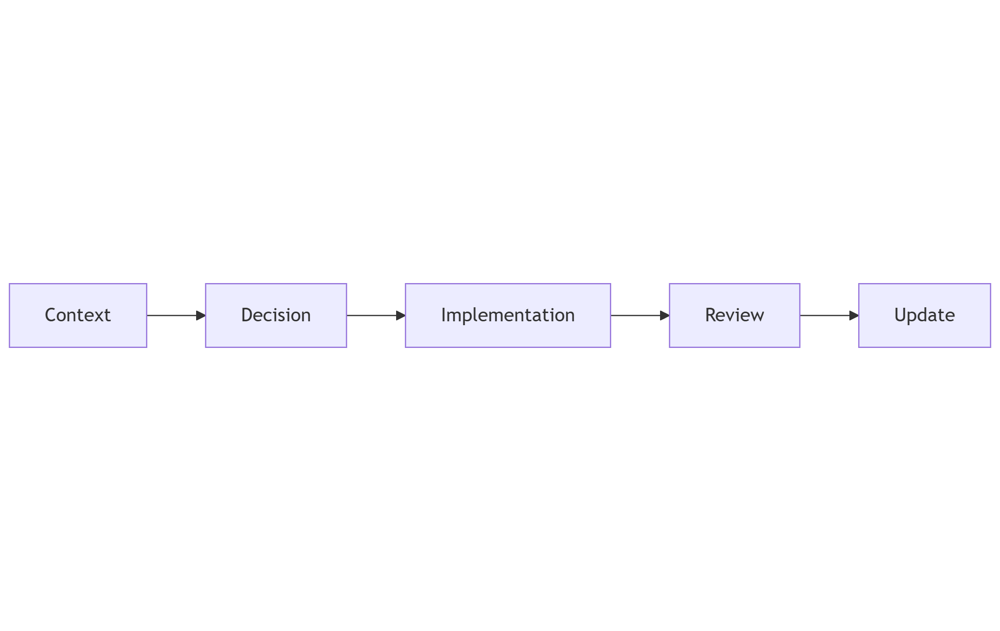

---
layout:
  width: default
  title:
    visible: true
  description:
    visible: false
  tableOfContents:
    visible: true
  outline:
    visible: true
  pagination:
    visible: true
  metadata:
    visible: true
---

# Architecture design records (ADR)

### Purpose

Track significant architecture decisions and their rationale.

This ensures long-term traceability.

***

### Scope

Includes:

* Technology selection decisions
* Major design changes
* Trade-offs

***

### Audience

* Platform owner
* Reviewers
* Future collaborators

***

### How to Read This Section

Read ADRs in chronological order.

***

### Contents

* ADR-0001 — Proxmox Choice
* ADR-0002 — Network Segmentation Strategy

***

### Decision Lifecycle

<figure><figcaption></figcaption></figure>

***
