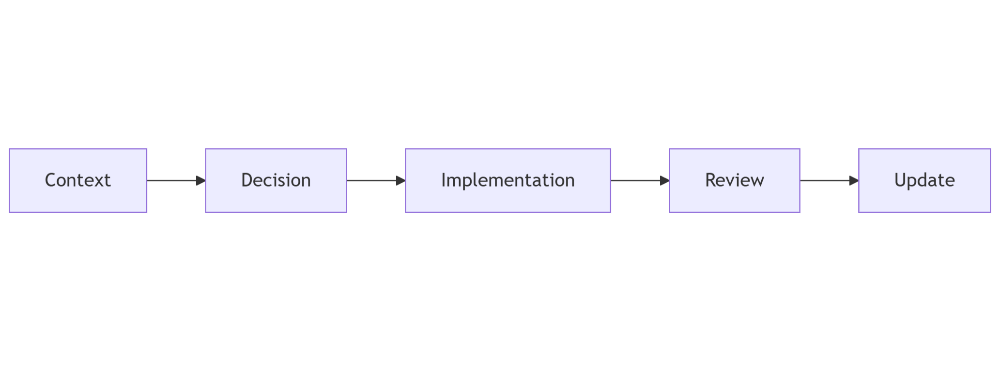

# Architecture design records (ADR)

### Purpose

Track significant architecture decisions and their rationale.

This ensures long-term traceability.

***

### Scope

Includes:

* Technology selection decisions
* Major design changes
* Trade-offs

***

### How to Read This Section

Read ADRs in chronological order.

***

### Decision Lifecycle

<figure><figcaption></figcaption></figure>
