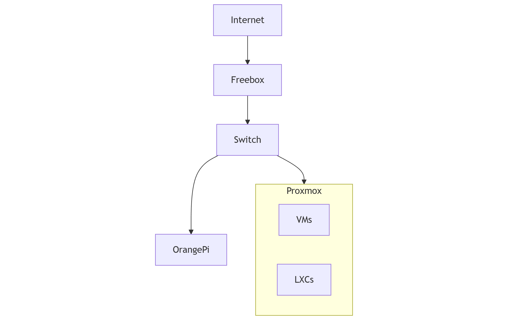

---
layout:
  width: default
  title:
    visible: true
  description:
    visible: false
  tableOfContents:
    visible: true
  outline:
    visible: true
  pagination:
    visible: true
  metadata:
    visible: true
---

# Environment

### Purpose

Describe the current technical environment and baseline infrastructure.

This section represents the **source of truth** regarding the existing platform state.

***

### Scope

Includes:

* Current architecture
* Hardware inventory
* Network topology
* IP addressing
* Platform capabilities
* Use cases

***

### Audience

* Infrastructure engineers
* Reviewers
* Future operators

***

### How to Read This Section

1. Current Architecture
2. Hardware Inventory
3. Network Topology
4. IP Addressing Plan
5. Platform Capabilities
6. Use Cases

***

### Contents

* **Current Architecture**\
  Description of the existing infrastructure.
* **Hardware Inventory**\
  List of physical equipment.
* **Network Topology**\
  Current and target network segmentation.
* **IP Addressing Plan**\
  Subnet and VLAN structure.
* **Platform Capabilities**\
  Existing and planned functional capabilities.
* **Use Cases**\
  Supported scenarios.

***

### Related Sections

* Strategy
* Architecture Design Records

***

### High-Level Environment Diagram

<figure><figcaption></figcaption></figure>

***
