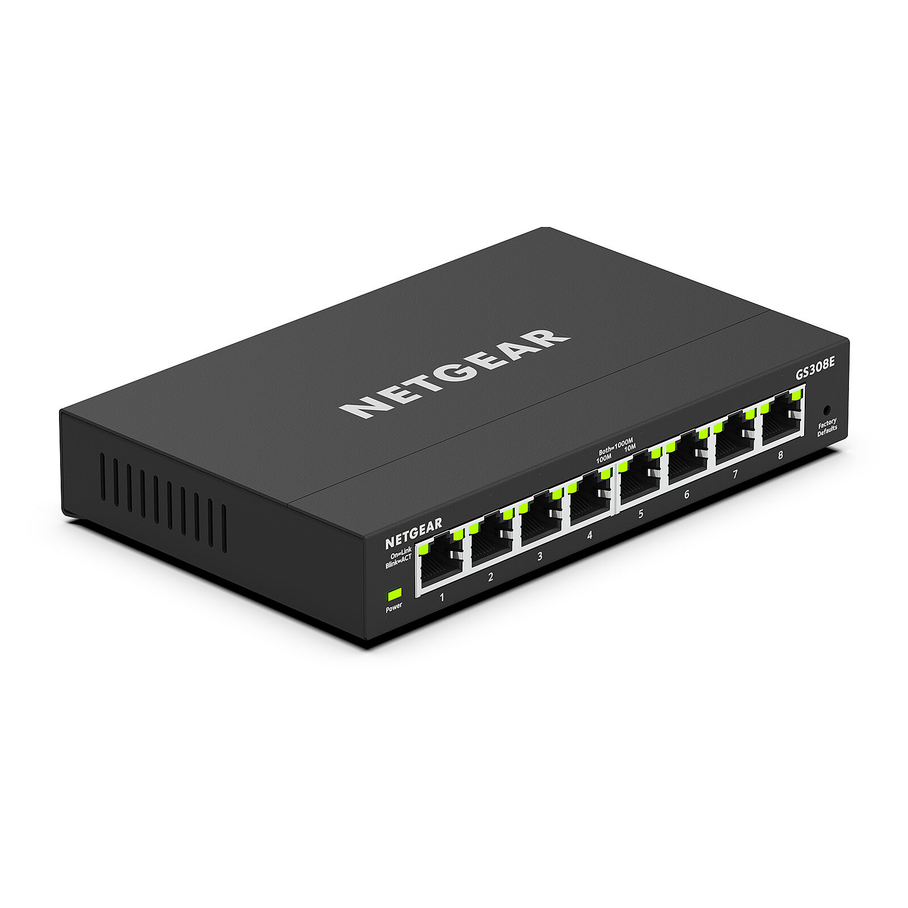
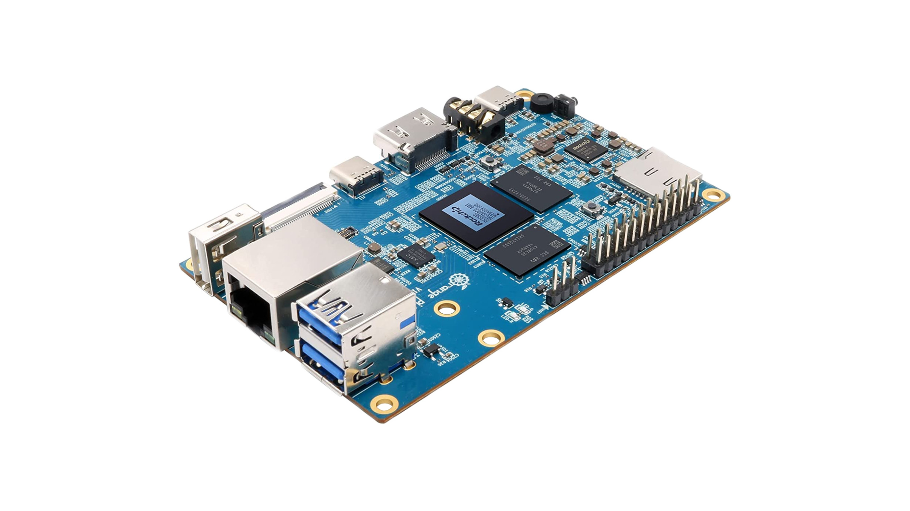

---
layout:
  width: default
  title:
    visible: true
  description:
    visible: false
  tableOfContents:
    visible: true
  outline:
    visible: true
  pagination:
    visible: true
  metadata:
    visible: true
---

# Hardware inventory

### Primary Compute Node

**Model:** Dell Optiplex 3080 SFF\
**CPU:** Intel i5-10505\
**Memory:** 32 GB DDR4

<figure><figcaption></figcaption></figure>

#### Storage

* NVMe 256 GB (system disk)
* Planned: 2 × SATA SSD (ZFS mirror for VM storage)

#### Network Interfaces

* Onboard Ethernet
* Intel I350-T2 (dual RJ45)

The additional NIC is intended to support future routing, segmentation and firewall scenarios.

***

### Network Equipment

**Managed Switch:** Netgear GS308E\
Capabilities:

* VLAN 802.1Q
* Port mirroring
* Layer 2 switching

**ISP Router:** Freebox Pop

Currently providing DHCP and NAT services.

<figure><figcaption></figcaption></figure>

***

### Auxiliary Node

**Device:** Orange Pi 5\
**Memory:** 8 GB

Used for:

* Lightweight services
* Testing workloads
* Potential quorum node in future cluster scenarios

<figure><figcaption></figcaption></figure>
