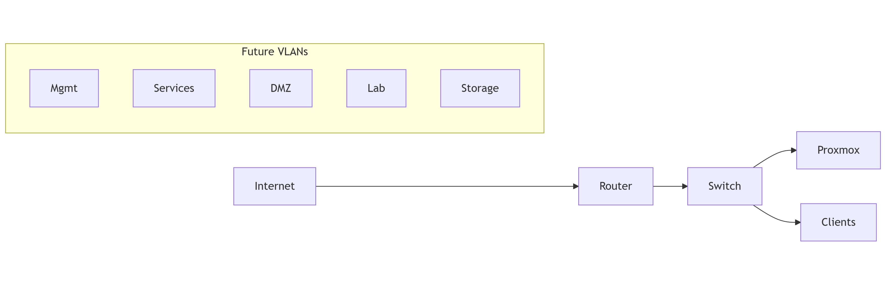

---
layout:
  width: default
  title:
    visible: true
  description:
    visible: false
  tableOfContents:
    visible: true
  outline:
    visible: true
  pagination:
    visible: true
  metadata:
    visible: true
---

# Network topology

### Current State

The network currently operates as a flat LAN behind the ISP router.

All devices share the same broadcast domain.

***

### Planned Segmentation

The target design introduces logical separation using VLANs.

| VLAN       | Purpose                       |
| ---------- | ----------------------------- |
| Management | Infrastructure administration |
| Services   | Internal applications         |
| DMZ        | Exposed services              |
| Lab        | Experimental workloads        |
| Storage    | Backend traffic               |

Routing between segments will eventually be handled by pfSense or OPNsense.

***

### Logical Layout

<figure><figcaption></figcaption></figure>
