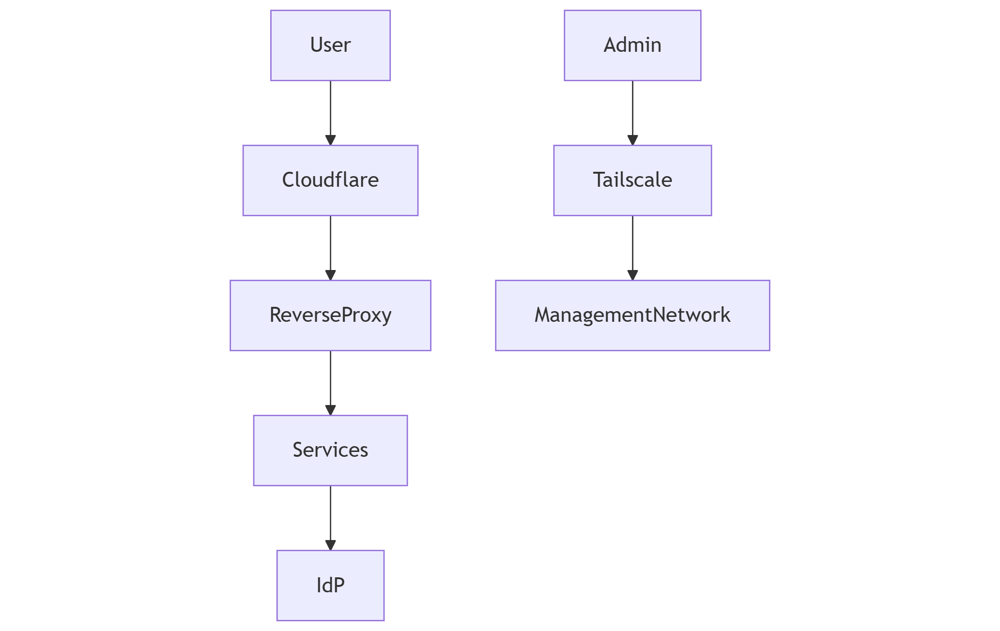

---
layout:
  width: default
  title:
    visible: true
  description:
    visible: false
  tableOfContents:
    visible: true
  outline:
    visible: true
  pagination:
    visible: true
  metadata:
    visible: true
---

# Target audience & access model

### Audience

The platform is designed for multiple categories of users:

* **Platform Owner**\
  Primary administrator responsible for architecture, operation and evolution.
* **Trusted Users**\
  Friends or family members granted controlled access to selected services.
* **Public Users**\
  Anonymous visitors accessing intentionally exposed services such as:
  * Personal website
  * Demonstrations


These services remain protected by edge-level security controls.


***

### Access Model

The platform follows an identity-centric access strategy.

#### Administrative Access

* Restricted to authenticated identities
* MFA required
* Preferably accessed through VPN or Zero Trust mechanisms

***

#### Authenticated User Access

* Access granted based on group membership
* Limited to authorized services

***

#### Public Exposure

* Only explicitly intended services are exposed
* Protected by reverse proxy and edge security layers

***

### Access Architecture

<figure><figcaption></figcaption></figure>

***
