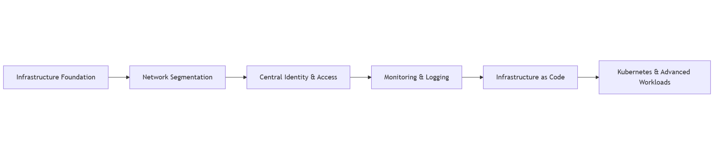

# Vision & philosophy

### Overview

This home lab project is designed as more than a personal server or a collection of self-hosted services.\
It aims to be a living private cloud platform, continuously evolving, that reflects modern infrastructure design principles while remaining grounded in real-world constraints.

The core vision is to bridge the gap between experimentation and production-grade thinking by applying professional architectural patterns within a personal environment.

***

### Learning by Design, Not by Accident

One of the central objectives of this platform is to support intentional and structured learning.

The infrastructure is used to:

* Explore modern paradigms such as Zero Trust, Infrastructure as Code, GitOps and cloud-native workloads.
* Understand trade-offs between simplicity, security, performance and operational complexity.
* Reproduce real-world scenarios encountered in professional environments, including failures, migrations and scaling challenges.

The goal is not to follow trends blindly, but to understand why architectural patterns exist, when they make sense, and when they do not.

***

### Security & Privacy by Design

Security is treated as a foundational capability rather than a later hardening step.

This includes:

* Identity-based access rather than network-based trust.
* Strong authentication and MFA.
* Clear separation between administrative access, user access and public exposure.
* Minimization of the attack surface by default.

Privacy is also considered a design constraint:

* Sensitive data remains self-hosted whenever possible.
* External services are used consciously and selectively.
* Dependencies on third-party platforms are evaluated in terms of risk, resilience and lock-in.

***

### Autonomy Without Isolation

Although self-hosted, the platform is intentionally designed to remain compatible with modern cloud ecosystems.

The architecture combines:

* Self-hosted infrastructure components.
* Select external services that provide clear value (identity, access, availability, edge protection).
* Designs that remain portable between on-premise and cloud environments.

The objective is autonomy, not reinvention.

***

### Progressive Complexity & Evolution

The infrastructure evolves gradually:

* Starting simple when appropriate.
* Introducing complexity only when justified by real needs or learning objectives.
* Avoiding premature over-engineering.

Not all services require the same level of availability, automation or isolation.\
Some components are intentionally lightweight, while others are used to experiment with advanced patterns such as Kubernetes, GitOps workflows or high availability configurations.

***

### Reproducibility & Ephemerality

A key philosophy behind the project is that infrastructure should be reproducible and disposable.

Whenever possible:

* Systems can be rebuilt from code.
* Configuration is version controlled.
* Automation is preferred over manual intervention.

The ability to destroy and recreate components is considered a feature, provided that state and data are properly protected.

***

### A Platform, Not a Product

This environment is not intended to be a static or polished product.

It is a continuously evolving platform used for:

* Experimentation
* Learning
* Iteration
* Architectural refinement

Refactors and redesigns are expected and considered part of the learning process.

***

### Platform Evolution Model

<figure><figcaption></figcaption></figure>

