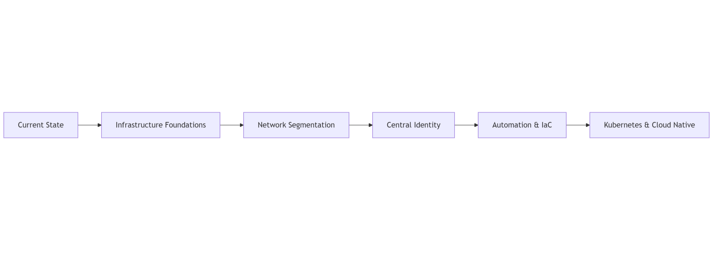

---
layout:
  width: default
  title:
    visible: true
  description:
    visible: false
  tableOfContents:
    visible: true
  outline:
    visible: true
  pagination:
    visible: true
  metadata:
    visible: true
---

# Strategy

### Purpose

Define how the platform evolves over time.

This section captures the transformation from current state to target architecture.

***

### Scope

Includes:

* Roadmap
* Evolution milestones
* Technical debt tracking

***

### How to Read This Section

1. Roadmap & Evolution
2. Technical Debt

***

### Contents

* **Roadmap & Evolution**\
  Short, mid, and long-term objectives.
* **Technical Debt**\
  Known limitations and remediation plan.

***

### Evolution Concept Diagram

<figure><figcaption></figcaption></figure>

***
