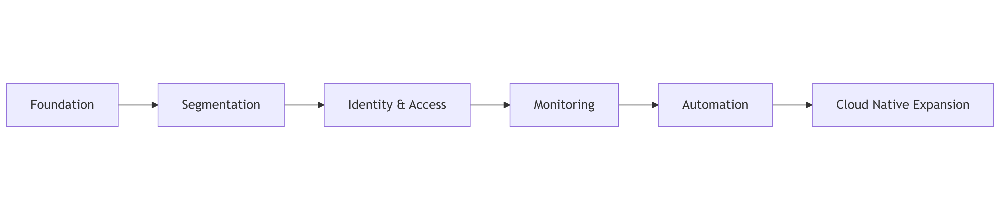

# Roadmap & evolution

### Evolution Approach

The platform evolves through incremental capability building.

Each stage introduces new functionality only after validating the stability of the previous layer.

The objective is to reduce operational risk while steadily increasing maturity.

***

### Phase Model

<figure><figcaption></figcaption></figure>

***

### Short-Term (0–3 Months)

Primary focus:

* Stabilize Proxmox environment
* Implement secure remote access
* Establish documentation baseline
* Prepare storage redundancy
* Deploy Vaultwarden

Expected outcomes:

* Reliable base infrastructure
* Secure administrative access
* Clear inventory and topology

***

### Mid-Term (3–9 Months)

Primary focus:

* Introduce VLAN segmentation
* Deploy pfSense or OPNsense
* Implement centralized identity provider
* Deploy monitoring stack

Expected outcomes:

* Improved security posture
* Better observability
* Controlled access management

***

### Long-Term (9–24 Months)

Primary focus:

* Multi-node cluster
* Infrastructure as Code workflows
* Kubernetes experimentation
* SOC capabilities

Expected outcomes:

* Higher resilience
* Automated provisioning
* Advanced experimentation environment

***

### Guiding Principles

* Avoid premature complexity
* Validate each layer before expanding
* Maintain documentation alongside implementation

